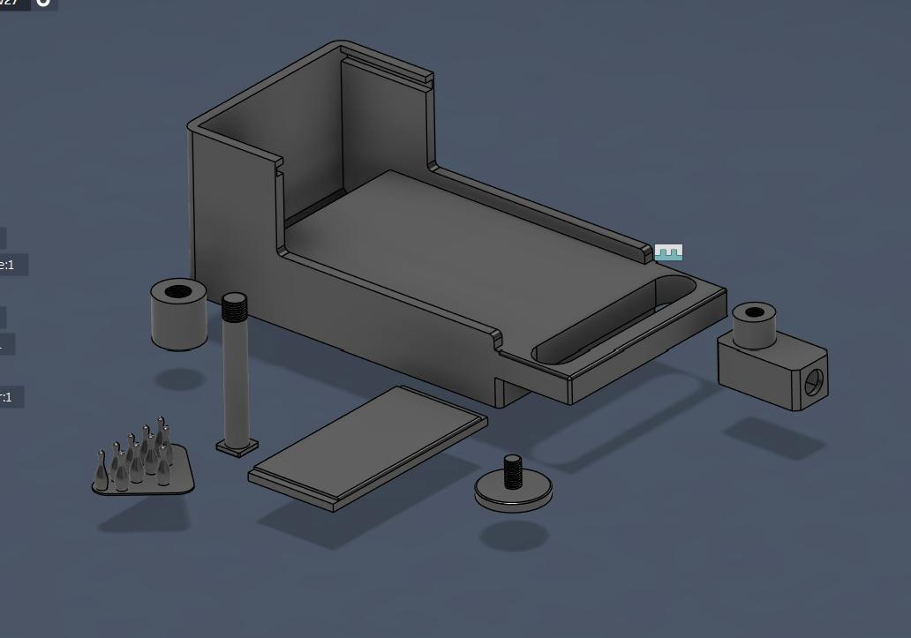
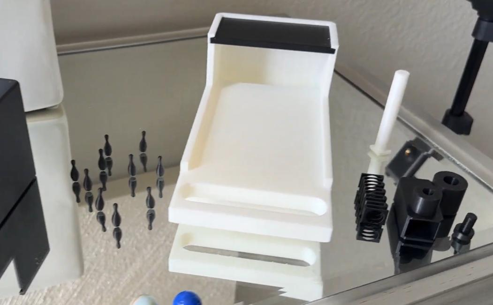

# Tabletop Bowling Game

Designed and manufactured from scratch in Autodesk Fusion 360 using additive manufacturing (3D printing).

---

# Overview

This project involved designing, manufacturing, and testing a fully functional tabletop bowling game. Every component was modeled from scratch in Autodesk Fusion 360 and manufactured using 3D printing.

The completed design features a spring-powered marble launcher, removable bowling pins, and an integrated ball return system. Throughout development, multiple design iterations were required to improve manufacturability, assembly, and overall functionality.

---

# Project Objective

Design and manufacture a fully functional tabletop bowling game that incorporates multiple mechanical mechanisms while demonstrating CAD modeling, additive manufacturing, and iterative engineering design.

---

# Design Requirements

The project was designed to:

- Launch a marble using a spring-powered mechanism
- Knock down removable 3D-printed bowling pins
- Return the marble to the front of the game after each shot
- Be fully manufacturable using 3D printing
- Be easily assembled and disassembled

---

# My Responsibilities

This project was completed independently.

Responsibilities included:

- Designing every component in Autodesk Fusion 360
- Creating the complete assembly from scratch
- Designing for additive manufacturing
- 3D printing all components
- Assembling the final product
- Testing functionality
- Redesigning components through multiple iterations

---

# Design Features

- Spring-powered marble launcher
- Pull-back firing mechanism
- Integrated marble return system
- Modular assembly
- Replaceable bowling pins
- Compact desktop footprint

---

# Manufacturing

Software Used

- Autodesk Fusion 360

Manufacturing Process

- UltiMaker Cura

---

# Engineering Challenges

The most difficult aspect of the project was designing the marble return system.

After the marble traveled down the lane and struck the bowling pins, it needed to roll back toward the front of the game where it could easily be retrieved.

Early prototypes experienced issues with clearances and tolerances, preventing the marble from rolling smoothly through the return channel.

Multiple CAD revisions and printed prototypes were produced before achieving a design that consistently returned the marble while maintaining smooth operation.

This iterative process reinforced the importance of tolerance optimization and prototype testing during mechanical design.

---

# Design Iterations

This project required several design revisions.

Each iteration focused on improving:

- Part tolerances
- Fit between components
- Ease of assembly
- Reliability of the marble return system
- Overall functionality

Testing each prototype helped identify areas for improvement before producing the final design.

---

# Results

Successfully designed, manufactured, assembled, and tested a fully functional tabletop bowling game.

The final design successfully demonstrated:

- Reliable marble launching
- Functional ball return
- Repeatable gameplay
- Improved manufacturability through multiple iterations

---

# Engineering Skills Demonstrated

- Mechanical Design
- CAD Modeling
- Autodesk Fusion 360
- Design for Manufacturing (DFM)
- Additive Manufacturing
- Tolerance Optimization
- Mechanical Assembly
- Rapid Prototyping
- Engineering Testing
- Iterative Design

---

# What I Learned

This project strengthened my understanding of:

- CAD assembly design
- Designing for 3D printing
- Mechanical tolerancing
- Engineering iteration
- Prototype evaluation
- Problem-solving through repeated testing

The experience reinforced that successful engineering designs are rarely achieved on the first attempt and often require multiple revisions before reaching a reliable final product.

---

# Gallery

## CAD Assembly

## Final Product

---

# Project Demonstration

🎥 Watch the complete project walkthrough:

[(Paste your YouTube link here)](https://www.youtube.com/watch?v=Qr1CuaDyMkA)

---

# Future Improvements

Future versions of this project could include:

- Automatic bowling pin reset mechanism
- Adjustable launcher power
- Improved launcher ergonomics
- Faster assembly
- Reduced print time
- More durable pin materials
- Score tracking system
